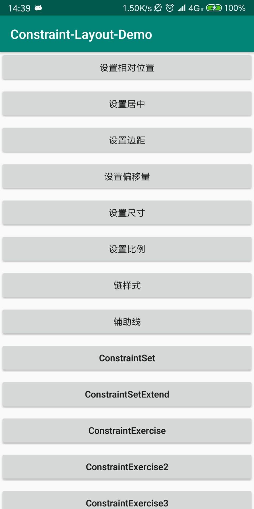
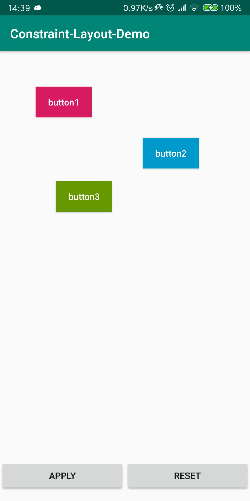

# ConstraintLayoutDemo

Android 约束布局练习，从此，再复杂的布局也能轻松应对了！

(还没使用约束布局的同学，推荐大家使用约束布局，是真的强大！当然，刚开始用也免不了踩坑，踩坑是暂时的，成长才是永久的！)

先从手写代码开始，不建议先从拖拽开始，如果你手写布局都会了，拖拽自然而然就会了。

## 1.开发环境和依赖库版本

* Android Studio 3.2
* constraint-layout:1.1.3

## 2.部分截图如下：

参考文章：

[https://github.com/xitu/gold-miner/blob/master/TODO/constraint-layout-hell.md](https://github.com/xitu/gold-miner/blob/master/TODO/constraint-layout-hell.md)

[https://github.com/xitu/gold-miner/blob/master/TODO/constraint-layout-concepts-hell-tips-tricks-part-2.md](https://github.com/xitu/gold-miner/blob/master/TODO/constraint-layout-concepts-hell-tips-tricks-part-2.md)

[https://github.com/xitu/gold-miner/blob/master/TODO/constraint-layout-animations-dynamic-constraints-ui-java-hell.md](https://github.com/xitu/gold-miner/blob/master/TODO/constraint-layout-animations-dynamic-constraints-ui-java-hell.md)

[https://github.com/xitu/gold-miner/blob/master/TODO/constraint-layout-visual-design-editor-hell.md](https://github.com/xitu/gold-miner/blob/master/TODO/constraint-layout-visual-design-editor-hell.md)

[https://developer.android.com/reference/android/support/constraint/ConstraintLayout](https://developer.android.com/reference/android/support/constraint/ConstraintLayout)

## TODO

- Group
Group帮助你对一组控件进行设置。最常见的情况是控制一组控件的visibility。你只需把控件的id添加到Group，就能同时对里面的所有控件进行操作。

- Circular positioning
可以相对另一个控件，以角度和距离定义当前控件的位置，即提供了在圆上定义控件位置的能力。

